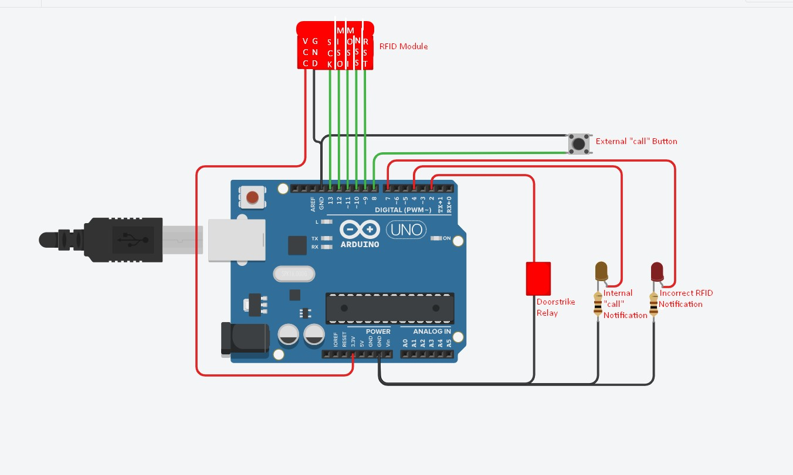

# Arduino Door Lock

A simple project using an Arduino Uno in conjunction with an RC522 RFID module and electronic door strike. See the circuit diagram image for connections.

## RIFD Module Pin Connections

Arduino Pin No | RFID Pin No
-------|-------
D9 | RST
D10 | NSS
D11 | MOSI
D12 | MISO
D13 | SCK
3.3V | VCC
GND | GND

## Parts Needed

* Arduino Uno Board (or similar)
* RC522 RFID module
* LEDs to suit
* Switches/buttons to suit
* 100 Ohm resistors
* Relay module compatable with Arduino (to drive the doorstrike)

## Initial Setup

Once you have assembled the circuit as above, open the code above in the arduino software and replace the " ** ** ** ** " with the appropriate id of the RFID fob/card you wish to use. Upload the code to your arduino and you should be good to go.

## Operation

Upon presenting the correct RFID fob to your RFID module the door strike relay (pin 2) should activate for 3 seconds. If you present an incorrect RFID fob the LED on pin 7 will light indefinitely until the arduino is reset. You could modify the code to include another input pin which will turn this LED off without needing to reset. 

If a user presses the button on pin 8, the LED on pin 4 will light for 10 seconds. Currently the code is written in a way which would stop the RFID module working while the Arduino is in the 10 second delay. I have a pushbutton on the inside of the room secured by this lock which is directly connected between the 12v supply and the doorstrike so I have no need for the RFID module to be active during this time as the external call button will likely only be used by people without the RFID fob necessary to operate the doorstrike from outside.

## Future

I plan to add a piezo to one of the unused Arduino pins to make sound when the doorstrike is active, perhaps also to give a different sound when an incorrect RFID fob is presented.

I may get rid of the 10 second delay on the "call" indication LED and have it just stay on until a newly added input on a spare pin is pressed at which point the LED turns off. This would allow the internal used to not miss the call if they happaened to not be looking at the LED, it would also allow the RFID module to resume operation instead of being effectively "disabled" while the current 10 second delay is happening.

### Feel free to fork this project to your own repo and make changes to suit your own situations. Everything here is open source and you are free to do as you wish with your own copy.
